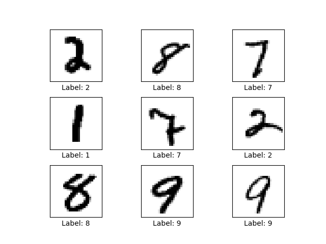

# Athena

An experiment in neural network creation, created as my Stackathon project for Fullstack Academy.

Written in python.

Required Libraries:
- `tensorflow` - for the actual machine learning
- `matplotlib` - for visualizations
- `pillow` - for image proccessing the visualizations

<hr>

> **NOTES:** 
> - Any images generated by running scripts in this repo will show up in directory:    
>    `images/`
> - Any datasets generated or downloaded by running scripts in this repo will show up in directory:  
>   `datasets/`
> - Convolutional models would be better suited for these demonstrations, but for the sake of simplicity I'll be using simple linear regression modles.
>
> .
<hr>

# Neural Nets
Neural nets can be described as function approximators.  The purpose of a basic neural net is to learn the function that will give you the desired output for a particular input, such as labelling a picture as either a dog or a cat.

The learning process happens by taking various input-output pairs and iteratively finding the function that will produce output Y from input X. This is called training.

Before we go into how that iterative process works, we need to examine what exactly makes up the architecture of a neural net:

- **Layers:**<br>
    The major components of a neural net are called ***"layers"***.  In general every model has at least 3 layers: 
    - input layer
    - output layer
    - at least 1 hidden layer
    <div align="center">
    
    <br><b>
    Input Layer [ Yellow ] =>
    Hidden Layers [ Green ] =>
    Output Layer [ Red ]
    </b>
    </div>


    A numerical representation of the the input data (in this case pixel values) gets fed into the input layer, then is modified by the hidden layers in order to return the result in the output layer.

- **Hidden Layer:**<br>
    The hidden layers are each made up of 2 dimensional arrays (matrices) of float values, often called the ***"weights"***. The matrix multiplication of these weights with the data representation from the previous layer is meant to approximate the function the neural net is trying to "learn".

    In essense what the net learns is:
    
        "What blob of numbers can I multiply with my input to consistently get the correct output?"


## Backpropagation:
When the neural net ( often referred to as the ***"model"*** ) is first created, the hidden layer weights start off as completely random numbers.

During the training phase, we repeatedly and randomly supply the developing model
with different input output pairs, `[ x, y ]` and the training process iteratevly figures out how to adjust the hidden layer weight matrix values in order to create `y` from `x`, effectively approximating `f(x)` so that it equals `y`.

this happens by taking it's own output prediction `[ z ]` and calcualting the difference between that and `y`.

For each number in the weights matrix, the derivative of this difference with respect to each matrix value is calcuated. The values of the weights matrix are then slightly adjusted in a direction informed by the gradient that would
"minimize" the difference between `z` and `y`.

This is a very gradual process for each iteration, as the model needs to be able to generalize, so it can deal with inputs it hasn't trained on, showing us that it actually learned `f(x)`, and that it didn't just "memorize" the training data.

this whole process is referred to as *"supervised learning"*, since we supply the target answers during training.

## Testing:
To actually test how the model is learning, a seperate batch of data is set aside as the ***"test dataset"***, and the model's accuracy is considered on how it labels this test set.  During training the model never trains on this test dataset, in order to see how it labels completely novel datapoints.

## Implementation:

Luckily we don't have to implement all that calculus and matrix multiplication ourselves, we can jsut use third party libraries such as Tensorflow!

In the `feed_forward_nn.py` file is a demo with well documented code that shows how to implement a simple linear regression model with tensorflow.

> Running:
> ```bash
> $ python feed_forward_nn.py
> ```
> in the command line will run the file and train the model to label images of handwritten digits [ 0 - 9 ] from the MNIST dataset.

The script starts off by loading the MNIST dataset and asserting that the images and labels are aligned correctly in their arrays:

<div align="center">

<br><b>Making sure the correct labels correspond to the correct images</b></div>
<br>
After asserting that the dataset is correctly initialized, we build the model and run a prediction on 9 random datapoints of the test set:

<div align="center">

<br><b>Model predictions before training</b></div>
<br>
As the model is not trained yet, all the predictions are wrong (if there are any correct ones, we can consider them "lucky guesses"). We can use this visualization to compare the predictions after training.

The training will run for only 1000 iterations, but as you can see from the logs and generated accuracy graph, it reaches at least 90% accuracy on the test set pretty quickly!


<div align="center">

<br><b>Accuracy over time while training</b></div>
<br>
A prediction is run and visualized on 9 random datapoints form the test set again.  This time the model has correctly labelled most (if not all) of the digits.

<div align="center">
<br><b>
Prediction on 9 random digits from the test set.</b>
</div>
<br>
It's interesting to see the mistakes and intricacies of the models 'thought' proccess.  For instance, in the middle image, it learned to ignore random noise around teh image ( the two dots on the right side ) and correctly predicted it as a `1`.  Whereas in the bottom-middle image of a `7` was incorrectly labelled as a `9`, but maybe the model was taking into account the features of a `9` that are curved horizontal lines sticking out of a vertical line, (that `7` could be considered an incomplete `9`).

# General Adversarial Networks


A more advanced type of neural network used for different purposes is called a General Adverserial Network or ***"GAN"***.

GANs are generally used to create data from 'scratch'. You've probably seen this type of model in action generating images of faces.

<div align="center">

<br><b>
These people don't actually exist.
</b></div>
<br>

The implementation of these models closely follows the basic Neural Net defined above ( an iterative
process of gradually changing the hidden layer weights in order to achieve the optimal result ). The major difference is in the architecture and what the input-output pairs are when training.

## Architecture
GANs are made up of 2 different neural nets connected together, a ***"Generator"*** and a ***"Discriminator"***.<br>They both have seperate "tasks" to learn:
- The Generator takes in a random set of numbers ( noise ) as an input and eventually outputs a 'created' version of a single datapoint (i.e. an image)
- The Discriminator takes that generated output as its input, and outputs a binary output of either:
    - `0` if it determines that the input was fake (generated by the Generator) or
    - `1` if it determines that the input was a real data point (i.e. a real picture of someones face)

<div align="center">

<br><b>
Diagram of the architecture of a General Adversarial Network.
</b></div>
<br>

## Training
Through the training process, the Discriminator is trained to tell the difference between the generated data points and the real data points (using the same process of backpropagation detailed above).

While doing that, the Generator is also trained on how to generate datapoints such that the Discriminator will not be able to tell the difference. It does this through backpropagation as well, except that we set the target output of the Discriminator to be an output of "real data point" (`1`) when given an input generated by the Generator.

as the Discriminator gets better at telling the fake and real data apart, the Generator uses the hidden layers of the Discriminator to get better at generating more realistic data.


## Implementation:

In the `gan_nn.py` file is a demo with well documented code that shows how to implement a GAN model with tensorflow.

> Running:
> ```bash
> $ python gan_nn.py
> ```
> in the command line will run the file and train the model to generate images of handwritten digits [ 0 - 9 ] similar to the MNIST dataset.

The file will train the model for 100,000 iterations, and generated images will be saved throughout the training process so we can track the Generator's progress.


<div align="center">

<br><b>
Evolution of the generated handwritten digits</b></div>
<br>

We also track the loss of the Generator and Discriminator as well:

<div align="center">

<br><b>
Losses throughout training</b></div>
<br>

We can see with the loss decrease for both parts, that the Discriminator and Generator get better at their tasks. But we can see through the chaotic fluctuation throughout the iterations that they are in direct competition with eachotehr.  When the Generator gets better, the Discriminator has a tougher time telling real and fake data apart, and when the Discriminator gets better, the Generator has trouble generating an image that the Discriminator thinks is real.