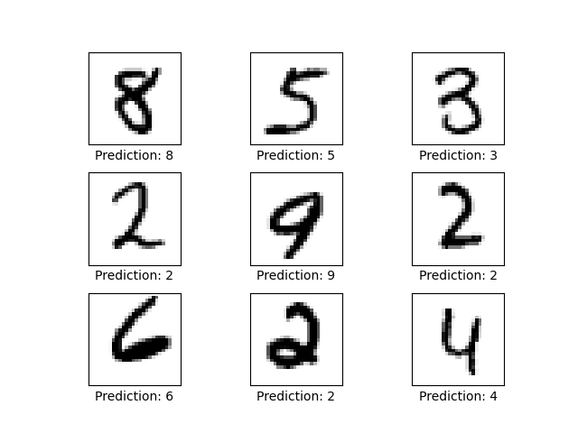

# Athena
An experiment in neural network creation, created as my Stackathon project for Fullstack Academy.

### Can we create a Neural Network that creates other Neural Networks?

Written in python.

Required Libraries:
- `tensorflow` - for the actual machine learning
- `matplotlib` - for visualizations
- `pillow` - for image proccessing the visualizations

><hr>
>
> **NOTES:** 
> - Any images generated by running scripts in this repo will show up in directory:    
>    `images/`
> - Any datasets generated or downloaded by running scripts in this repo will show up in directory:  
>   `datasets/`
> - Convolutional models would be better suited for these demonstrations, but for the sake of simplicity I'll be using linear regression modles.
><hr>

## If you're already familiar with Neural Nets and General Adversarial Networks, [you can skip right to the section that's the focus of this repo.](#the-athena-model)

# Neural Nets

Neural nets can be described as function approximators.  The purpose of a basic neural net is to learn the function that will give you the desired output for a particular input, such as labelling a picture as either a dog or a cat.

The learning process happens by taking various input-output pairs and iteratively finding the function that will produce output Y from input X. This is called training.

Before we go into how that iterative process works, we need to examine what exactly makes up the architecture of a neural net:

- **Layers:**<br>
    The major components of a neural net are called ***"layers"***.  In general every model has at least 3 layers: 
    - input layer
    - output layer
    - at least 1 hidden layer
    <br><br><br><div align="center">
    <br><sup><b>Input Layer [ Yellow ] => Hidden Layers [ Green ] => Output Layer [ Red ]</b>
    <br>A numerical representation of the the input data (in this case pixel values) gets fed into the input layer, then is modified by the hidden layers in order to return the result in the output layer.
    </sup></div>

- **Hidden Layer:**<br>
    The hidden layers are each made up of 2 dimensional arrays (matrices) of float values, often called the ***"weights"***. The matrix multiplication of these weights with the data representation from the previous layer is meant to approximate the function the neural net is trying to "learn".

    In essense what the net learns is:
    
        "What blob of numbers can I multiply with my input to consistently get the correct output?"


## Backpropagation:
When the neural net ( often referred to as the ***"model"*** ) is first created, the hidden layer weights start off as completely random numbers.

During the training phase, we repeatedly and randomly supply the developing model
with different input output pairs, `[ x, y ]` and the training process iteratevly figures out how to adjust the hidden layer weight matrix values in order to create `y` from `x`, effectively approximating `f(x)` so that it equals `y`.

this happens by taking it's own output prediction `[ z ]` and calcualting the difference between that and `y`.

For each number in the weights matrix, the derivative of this difference with respect to each matrix value is calcuated. The values of the weights matrix are then slightly adjusted in a direction informed by the gradient that would
"minimize" the difference between `z` and `y`.

This is a very gradual process for each iteration, as the model needs to be able to generalize, so it can deal with inputs it hasn't trained on, showing us that it actually learned `f(x)`, and that it didn't just "memorize" the training data.

this whole process is referred to as *"supervised learning"*, since we supply the target answers during training.

## Testing:
To actually test how the model is learning, a seperate batch of data is set aside as the ***"test dataset"***, and the model's accuracy is considered on how it labels this test set.  During training the model never trains on this test dataset, in order to see how it labels completely novel datapoints.

## Implementation:
Luckily we don't have to implement all that calculus and matrix multiplication ourselves, we can jsut use third party libraries such as Tensorflow!

In the `feed_forward_nn.py` file is a demo with well documented code that shows how to implement a simple linear regression model with tensorflow.
><hr>
>
> In the command line running:
> ```bash
> $ python feed_forward_nn.py
> ```
> will run the file and train the model to label images of handwritten digits [ 0 - 9 ] from the MNIST dataset.
><hr>

The script starts off by loading the MNIST dataset and asserting that the images and labels are aligned correctly in their arrays:

<div align="center">
<br><b><sup>Making sure the correct labels correspond to the correct images</sup></b></div><br>
After asserting that the dataset is correctly initialized, we build the model and run a prediction on 9 random datapoints of the test set:

<div align="center">
<br><b><sup>Model predictions before training</sup></b></div><br>
As the model is not trained yet, all the predictions are wrong (if there are any correct ones, we can consider them "lucky guesses"). We can use this visualization to compare the predictions after training.

The training will run for only 1000 iterations, but as you can see from the logs and generated accuracy graph, it reaches at least 90% accuracy on the test set pretty quickly!


<div align="center">
<br><b><sup>Accuracy over time while training</sup></b></div><br>
A prediction is run and visualized on 9 random datapoints form the test set again.  This time the model has correctly labelled most (if not all) of the digits.

<div align="center">
<br><b><sup>Prediction on 9 random digits from the test set.</sup></b></div><br>

It's interesting to see the mistakes and intricacies of the models 'thought' proccess.  For instance, in the middle image, it learned to ignore random noise around teh image ( the two dots on the right side ) and correctly predicted it as a `1`.  Whereas in the bottom-middle image of a `7` was incorrectly labelled as a `9`, but maybe the model was taking into account the features of a `9` that are curved horizontal lines sticking out of a vertical line, (that `7` could be considered an incomplete `9`).

# General Adversarial Networks

A more advanced type of neural network used for different purposes is called a General Adverserial Network or ***"GAN"***.

GANs are generally used to create data from 'scratch'. You've probably seen this type of model in action generating images of faces.

<div align="center">
<br><b><sup>These people don't actually exist.</sup></b></div><br>

The implementation of these models closely follows the basic Neural Net defined above ( an iterative
process of gradually changing the hidden layer weights in order to achieve the optimal result ). The major difference is in the architecture and what the input-output pairs are when training.

## Architecture
GANs are made up of 2 different neural nets connected together, a ***"Generator"*** and a ***"Discriminator"***.<br>They both have seperate "tasks" to learn:
- The Generator takes in a random set of numbers ( noise ) as an input and eventually outputs a 'created' version of a single datapoint (i.e. an image)
- The Discriminator takes that generated output as its input, and outputs a binary output of either:
    - `0` if it determines that the input was fake (generated by the Generator) or
    - `1` if it determines that the input was a real data point (i.e. a real picture of someones face)

<div align="center">
<br><b><sup>Diagram of the architecture of a General Adversarial Network.</sup></b></div><br>

## Training
Through the training process, the Discriminator is trained to tell the difference between the generated data points and the real data points (using the same process of backpropagation detailed above).

While doing that, the Generator is also trained on how to generate datapoints such that the Discriminator will not be able to tell the difference. It does this through backpropagation as well, except that we set the target output of the Discriminator to be an output of "real data point" (`1`) when given an input generated by the Generator.

as the Discriminator gets better at telling the fake and real data apart, the Generator uses the hidden layers of the Discriminator to get better at generating more realistic data.

## Implementation:
In the `gan_nn.py` file is a demo with well documented code that shows how to implement a GAN model with tensorflow.
><hr>
>
> In the command line running:
> ```bash
> $ python gan_nn.py
> ```
> will run the file and train the model to generate images of handwritten digits [ 0 - 9 ] similar to the MNIST dataset.
><hr>

The file will train the model for 100,000 iterations, and generated images will be saved throughout the training process so we can track the Generator's progress.


<div align="center">
<br><b><sup>Evolution of the generated handwritten digits</sup></b></div><br>

We also track the loss of the Generator and Discriminator as well:

<div align="center">
<br><b><sup>Losses throughout training</sup></b></div><br>

We can see with the loss decrease for both parts, that the Discriminator and Generator get better at their tasks. But we can see through the chaotic fluctuation throughout the iterations that they are in direct competition with eachotehr.  When the Generator gets better, the Discriminator has a tougher time telling real and fake data apart, and when the Discriminator gets better, the Generator has trouble generating an image that the Discriminator thinks is real.

# The Athena Model
Like Prometheus creating humans from clay in Greek mythology, when we create these models, we are essentailly creating the blueprints ( or husks ) of the algorithms, and letting them grow and change on their own through the training process. In that creation story though, life was breathed into humankind by the goddess Athena. 

<div align="center">
<br><b></b></div><br>

Could we draw inspiration from this part of the myth and apply it to our models?

Machine Learning has been shown to accomplish many amazing feats (sometimes even better than humans). So could we train a model to approximate the method of creating (or breathing life into) another neural net model without having to train it?

As we've demonstrated, GANs have been used to generate images that are strikingly similar to images found in a particular dataset. Grayscale images are nothing more than 2 dimensional matrices of pixel float values, which are much the same as a hidden layer weights on a typical neural network!

So, let's see if we can't train a GAN to generate 2D matrices to be used as 
weights in another model. We'll call it ***"A-GAN"*** (short for Athena-GAN).

Theoretically, given enough examples of weights from already trained and working models, this A-GAN should be able to create a completely novel set of values in one iteration that would be comparable to the values that come from a model trained through the sometimes long and exhaustive backpropagation process.

<hr>

**NOTE:**<br>
I've never tried this before, and am by no means a mathematician or data scientists, so this might be a complete wash, but let's try it and find out!
<hr>

## Goal:
The goal will be for A-GAN to create the weights of a model that can label the standard benchmark for image recognition: the MNIST dataset ( a series of images of handwritten numbers from 0 - 9 ).

First we'll see what the average accuracy is for several (let's say 100) untrained models (completely random weight values) on the data set. <br>This winds up being around 10%.

If A-GAN can generate something with a noticeable increase in accuracy, then we can consider this experiment a success and think further about optimizations, improvements, or other use cases

## Generating Data:
To generate the dataset that A-GAN will sample from to train, we need to first train many neural nets to label the MNIST dataset.

All these models will ahve one hidden layer each of the same dimensions, but since they are all initialized with random values, the trained versions should all have different weight values from eachother when fully trained as well. **( Although I'm not entirely sure, see the Conclusion and Concerns section below )**

Once each model is trained to test at 90% accuracy (at least), we'll store the weights and start over.  The entire dataset will be stored in a compressed numpy file:<br>`datasets/weights_dataset.npz` 

><hr>
>
> If you want to generate the dataset locally on your machine:
> - In the command line run:
>   ```bash
>   $ python weights_dataset.py
>   ```
>   This will create and infinite loop of training and storing trained weights.
> - This wil take a **LONG** time to generate many datapoints, so every 100 iterations, a temporary file is saved to disk in case you need to stop the loop and continue on again later.  These temporary files will be in the directory: `datasets/weights/`
> - To create the actual dataset, or append these temporary files from the last step to the dataset, run:
>   ```bash
>   $ python weights_dataset_combiner.py
>   ```
> - After running `weights_dataset_combiner.py`, you can delete the temporary files in the directory `datasets/weights/`
><hr>

## Training:
We will train A-GAN's Discriminator to tell the difference between a random set of values, and values that would be an ideal candidate for hidden layer weights that can label the MNIST dataset.

A-GAN's Generator will hopefully also learn how to generate values that can do so as well!

## Testing and Debugging:
We'll have a special testing version of a linear regression model that can have its hidden layer weights assigned to ( we'll call this model ***"TestNN"*** ).

To test the accuracy of generated models, A-GAN will generate 10 different weights matrices, assign each of them to the TestNN weights, and test TestNN agaisnt the MNIST dataset. We'll then print and track the average accuracy of all 10 tests.

## Implementation:
In the `athena_nn.py` file is a demo with well documented code that shows how to implement the A-GAN model with tensorflow.
><hr>
>
> In the command line running:
> ```bash
> $ python athena_nn.py
> ```
> will run the file and train the model to generate weight matrices that can label the MNIST dataset.
><hr>

The file will train the model for 1,000 iterations, track the accuracy of the generated models, and the losses of the A-GAN Generator and Discriminator.

During training we can see that the model quickly learns to generate weight matrices comparable to those trained through the normal process of backpropagation.  In fact, it generates models capable of 90% accuracy after only 500 iterations!

<div align="center">
<br><b><sup>Accuracy of generated models</sup></b></div><br>

<div align="center">
<br><b><sup>A-GAN losses throughout training</sup></b></div><br>

After training we generate a model using the A-GAN and visualize its predictions on a random set of 9 images from the MNIST test dataset:

<div align="center">
<br><b><sup>A-GAN generated model predictions</sup></b></div><br>

# Conclusion and Concerns
The experiment seems at first to be successful, as the goal of generating models that have comparable accuracy to normally trained models has been met.

It is highly suspicious that it learns to generate these models so quickly though.  It takes the GAN in `gan_nn.py` over 100,000 iterations to come up with readable digits, yet A-GAN reaches it's goal well within 1,000 iterations. Here are some possible reasons:
- **A-GAN becomes overfit:**
    <br> Since limited time was a factor, I created a weights dataset with only 2,100 entries.  Normally neural net training requires tens of thousands of examples to properly generalize their solutions, or else it can quickly learn to "memorize" the little data it's provided.
- **The trained weight matrix dataset values aren't all that different from one another:**
    <br> Perhaps an actual mathematician could help me out with this problem, but I could not think of a way to test or measure how "similar" two weight matrices are.<br>One reason I believe this might be the case is that we pose the problem of labelling the MNIST dataset as a Linear Regression problem.  
    
    <div align="center"><br><b></b></div><br>
    
    This is akin to just finding the line of best fit for a set of data points, and there is only ever ONE line that does that.

# Future Plans and Ideas
- Create multiple hidden layers as a sequence with a Recurrent A-GAN model
- Create a Cross-Domain A-GAN that can learn to simulate the training process, to try and gain more accuracy out of an already trained model by modifying it's weights.
